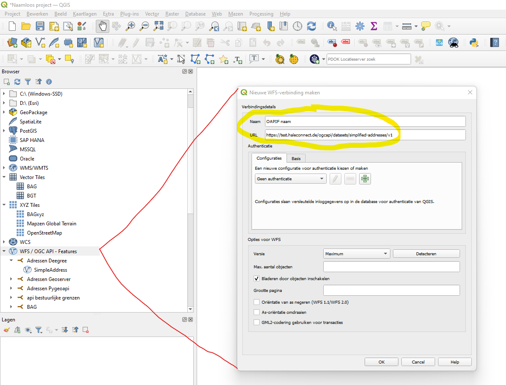

## OGC API Features explained

OGC API Features (OAPIF) is a multi-part standard for services that offer the capability to create, modify, and query spatial data on the Web. 
It specifies requirements and recommendations for APIs that want to follow a standard way of sharing feature data. 
The specification is a multi-part document. [[PUB-1]], [[PUB-5]], [[PUB-6]].

OAPIF is also the term used for a feature download service by means of an API (Application Program Interface) based on OGC standards. 
OAPIF has been considered as the successor of the OGC WFS standard, but that does not mean it will replace it in the near future, although eventually it might.
At this moment, they are complementary to each other. Where WFS is mainly known and used in the GIS community, the OAPIF is aiming at the non GIS-community, like web developers. 
OAPIF is easier to use and needs less knowledge in the spatial domain.
Note as well that WFS adopts the Geography Markup Language (GML) as a default data format. In contrast, OAPIF includes recommendations to support HTML and GeoJSON as encodings.
Implementations of OAPIF may also optionally support GML.

The basis of an OAPIF is the landing page. Examples are shown in https://geonovum.github.io/ogc-api-features-guideline/#H04.
An OAPIF consists of resources that can be retrieved by typing the corresponding path after the landing page of the OAPIF in a web browser or web application.
 
|Resource|Path|Purpose|
|--------|----|-------|
|Landing page|/|This is the top-level resource, which serves as an entry point.|
|Conformance declaration|/conformance|This resource presents information about the functionality that is implemented by the server.|
|API definition|/api|This resource provides metadata about the API itself. Note that the use of /api on the server is optional and the API definition may be hosted on a completely separate server.|
|Feature collections|/collections|This resource lists the feature collections that are offered through the API.|
|Feature collection|/collections/{collectionId}|This resource describes the feature collection identified in the path.|
|Features|/collections/{collectionId}/items|This resource presents the features that are contained in the collection.|
|Feature|/collections/{collectionId}/items/{featureId}|This resource presents the feature that is identified in the path.|

In the API definition, one can find all the supported encodings (HTML, JSON) and parameters that can be given along with the URL, such as a bounding box or a limit of the amount of features.
By default, an OAPIF service will provide access to a single dataset.
Rather than sharing the data as a complete dataset, the OGC API Features standards offer direct, fine-grained access to the data at the feature (object) level.

The best way of understanding the concept is looking at the examples that are discussed in the chapter of [examples](#H04).

Since providing a download service is an INSPIRE requirement when responsible for an INSPIRE dataset, the use of OAPIF can be considered for this purpose.
It is even seen as an endorsed <a href="https://inspire.ec.europa.eu/portfolio/good-practice-library/" target="_blank">Good Practice</a> within the INSPIRE community.

While the OAPIF is aiming at the non GIS-community, it is also easy to use for GIS-specialists within a GIS as is shown in the image below.
It works the same as loading a WFS. Only a service name and landing page is required.  
&nbsp;

