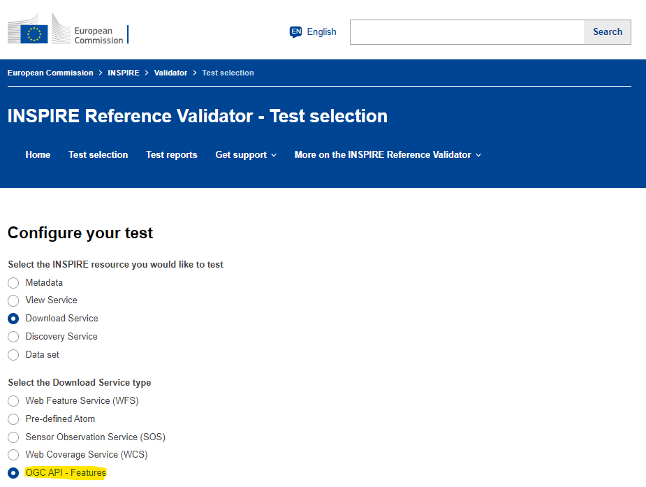

## Requirements

Below the most relevant requirements (or requirement classes) for setting up an OAPIF are listed:

| Nr | Source   | requirements | reference | 
|----|----------|--------------|-----------| 
| 1  | OAS      | Open API Specification| https://www.openapis.org/ |
| 2  | OGC      | [OGC API Features Core](https://docs.opengeospatial.org/is/17-069r4/17-069r4.html) | [[PUB-1]] |
| 3  | OGC      | CRS requirements | [[PUB-5]] |
| 4  | OGC      | [OGC filtering](https://docs.ogc.org/DRAFTS/19-079r1.html) | [[PUB-6]] |
| 5  | Dutch ADR| [Dutch API design rules](https://www.geonovum.nl/over-geonovum/actueel/rest-api-design-rules-op-pas-toe-leg-uit-lijst) | [[PUB-3]] |
| 6  | INSPIRE  | [INPSIRE-MIF document: Setting up an INSPIRE Download service based on the OGC API-Features standard](https://github.com/INSPIRE-MIF/gp-ogc-api-features/blob/master/spec/oapif-inspire-download.md) | [[PUB-2]] |
| 7  | INSPIRE  | [CRS requirements](https://github.com/INSPIRE-MIF/gp-ogc-api-features/blob/master/spec/oapif-inspire-download.md#req-crs) | [[PUB-2]] #req-crs |
| 8  | INSPIRE  | [multilinguality](https://github.com/INSPIRE-MIF/gp-ogc-api-features/blob/master/spec/oapif-inspire-download.md#82-requirements-class-inspire-multilinguality-) |  [[PUB-2]] #82-requirements-class-inspire-multilinguality- |
| 9  | INSPIRE  | [predefined download](https://github.com/INSPIRE-MIF/gp-ogc-api-features/blob/master/spec/oapif-inspire-download.md#req-pre-defined) | [[PUB-2]] #req-pre-defined |
| 10 | INSPIRE  | [bulk download](https://github.com/INSPIRE-MIF/gp-ogc-api-features/blob/master/spec/oapif-inspire-download.md#req-bulk-download) | [[PUB-2]] #req-bulk-download  |
| 11 | INSPIRE  | [GeoJSON](https://github.com/INSPIRE-MIF/gp-ogc-api-features/blob/master/spec/oapif-inspire-download.md#req-oapif-json) | [[PUB-2]] #req-oapif-json |
| 12 | INSPIRE  | INSPIRE validated GML as [input](https://inspire.ec.europa.eu/validator/about/) and [output](http://docs.opengeospatial.org/is/17-069r4/17-069r4.html#_requirements_class_geography_markup_language_gml_simple_features_profile_level_2) | https://inspire.ec.europa.eu/validator/about/ and [[PUB-1]] #_requirements_classes_for_encodings |
| 13 | INSPIRE  | [describing encoding](https://github.com/INSPIRE-MIF/2017.2/blob/master/GeoJSON/geojson-encoding-rule.md#inspire-requirements-for-encoding-rules) | [[PUB-4]] |

### OAS

The Open API Specification as set up by the [OpenAPI Initiative](https://openapis.org/) requires a document that describes an API or elements of an API. 
It can mostly be obtained by typing "openapi" behind the URL of the landing page of the service.
An OpenAPI document uses and conforms to the [OpenAPI Specification](https://spec.openapis.org/oas/v3.1.0).
It describes all the possible fields that can or should be used in the OpenAPI document.
The OpenAPI document MUST contain at least one paths field, a components field or a webhooks field.

### OGC

#### OGC API Features Core

[OGC API Features Core](https://docs.opengeospatial.org/is/17-069r4/17-069r4.html), [[PUB-1]] describes the basic requirements (50) and recommendations (17) according to OGC that one needs to follow, independent of INSPIRE. 
It describes which paths can be used and what responses one should receive. 
It does not make the use of the [OpenAPI Specification 3.0](https://spec.openapis.org/oas/v3.0.0)) mandatory, but if it is used, it gives an extra [requirement class](http://docs.opengeospatial.org/is/17-069r4/17-069r4.html#rc_oas30).
Presumably, this also counts for higher versions of the OpenAPI Specification.

The [GeoJSON requirement class](http://docs.opengeospatial.org/is/17-069r4/17-069r4.html#_requirements_class_geojson) in [[PUB-1]] recommends to support GeoJSON for features with geometry, but as stated in https://docs.opengeospatial.org/is/17-069r4/17-069r4.html#_encodings, no encoding is mandatory. 

[Metadata links](https://docs.ogc.org/is/17-069r4/17-069r4.html#rec_core_fc-md-descriptions) are recommended in [[PUB-1]] #rec_core_fc-md-descriptions.

There is an INSPIRE validation on the OGC standards for OAPIF available. It tests on OGC requirements, but it does not test the requirements as stated in [[PUB-2]].
&nbsp;&nbsp;

#### OGC CRS requirements

Both OGC and INSPIRE have requirements related to the CRS's used next to the basic requirement from the OGC API Features Core standard.
The [CRS requirement](https://docs.opengeospatial.org/is/17-069r4/17-069r4.html#_coordinate_reference_systems) in the OGC API Features Core standard [[PUB-1]], requires [WGS84](http://www.opengis.net/def/crs/OGC/1.3/CRS84) for 2D-data and [WGS84h](http://www.opengis.net/def/crs/OGC/0/CRS84h) for 3D-data as default.
The [OGC API - Features - Part 2 standard](http://docs.opengeospatial.org/is/18-058r1/18-058r1.html), [[PUB-5]] prescribes how to support different coordinate systems with OAPIF.
Among other requirements, the requirements concern a CRS identifier list, Storage-CRS, a bbox-crs parameter and a content-CRS in the header of the body of the response.

#### OGC Filtering

The specification for [filtering](https://docs.ogc.org/DRAFTS/19-079r1.html), [[PUB-6]] is still a draft version and has therefore not yet been taken into account.
Some basic filtering requirements are described in [OGC API - Features - Part 1: Core](http://docs.opengeospatial.org/is/17-069r4/17-069r4.html#_items_) [[PUB-1]].
This only concerns filtering with a bounding box and on properties.

### Dutch API design rules

Dutch data providers are recommended to follow the [Dutch API design rules](https://www.geonovum.nl/over-geonovum/actueel/rest-api-design-rules-op-pas-toe-leg-uit-lijst), [[PUB-3]].
In addition, the [Geomodule](https://docs.geostandaarden.nl/api/API-Strategie-mod-geo/) is recommended to be followed by Dutch data providers. 

For the Dutch data providers, it is recommended to also support [RD-coordinatesystem](https://www.opengis.net/def/crs/EPSG/0/28992) for 2D data or [RD +NAP](https://www.opengis.net/def/crs/EPSG/0/7415) for 3D data. See also: https://docs.geostandaarden.nl/crs/crs. 

### INPSIRE

[INPSIRE-MIF document: Setting up an INSPIRE Download service based on the OGC API-Features standard](https://github.com/INSPIRE-MIF/gp-ogc-api-features/blob/master/spec/oapif-inspire-download.md), [[PUB-2]] describes the specific INSPIRE requirements.
Most of them are explained in the next chapters.
This document does propose in [Note 2](https://github.com/INSPIRE-MIF/gp-ogc-api-features/blob/master/spec/oapif-inspire-download.md#81-requirements-class-inspire-pre-defined-data-set-download-oapif--) to make it a mandatory requirement for INSPIRE to comply with [OAPIF requirements class OpenAPI 3.0.](http://docs.opengeospatial.org/is/17-069r4/17-069r4.html#rc_oas30)

#### INSPIRE CRS

The [INSPIRE-CRS requirement class](https://github.com/INSPIRE-MIF/gp-ogc-api-features/blob/master/spec/oapif-inspire-download.md#req-crs) in [[PUB-2]] requires also one of the INSPIRE CRS's based on ETRS89 to be supported.

#### INSPIRE Multilinguality

The [multilinguality requirement class](https://github.com/INSPIRE-MIF/gp-ogc-api-features/blob/master/spec/oapif-inspire-download.md#82-requirements-class-inspire-multilinguality-), [[PUB-2]] is mandatory for all data sets that contain information in more than one natural language.
This is mostly not the case in the Netherlands, so it is of less importance.

#### INSPIRE Predefined download

The [predefined download requirement class](https://github.com/INSPIRE-MIF/gp-ogc-api-features/blob/master/spec/oapif-inspire-download.md#req-pre-defined),[[PUB-2]] consists of 3 requirements for each collection to link to:
1. the [metadata of the corresponding dataset](https://github.com/INSPIRE-MIF/gp-ogc-api-features/blob/master/spec/oapif-inspire-download.md#metadata-elements-of-the-data-set) in [[PUB-2]]
2. the corresponding entry in the [INSPIRE feature concept dictionary](https://inspire.ec.europa.eu/featureconcept)
3. the [license](https://github.com/INSPIRE-MIF/gp-ogc-api-features/blob/master/spec/oapif-inspire-download.md#terms-of-use)

#### INSPIRE Bulk download

The [bulk download requirement class](https://github.com/INSPIRE-MIF/gp-ogc-api-features/blob/master/spec/oapif-inspire-download.md#req-bulk-download), [[PUB-2]] requires links for enclosure of the total data set and/or of each separate collection.

#### INSPIRE and GeoJSON

The [GeoJSON requirement class](https://github.com/INSPIRE-MIF/gp-ogc-api-features/blob/master/spec/oapif-inspire-download.md#req-oapif-json) in [[PUB-2]] recommends to document how the GeoJSON encoding is retrieved from the INSPIRE data models.

#### INSPIRE and GML
The use of GML as encoding for INSPIRE data can be considered in two ways. As input and as output.

When we consider the input, one would like to be able to use a source dataset of harmonized data. In most cases, this will be a GML encoded dataset. 
The GML encoding is at least needed to validate the data set with the [EU INSPIRE  validator](https://inspire.ec.europa.eu/validator/about/).  
Unfortunately, not many tooling for creating a OAPIF service is able to use GML as input. Especially when it concerns a complex GML dataset. So, a transformation to another encoding like GeoJSON is needed.

Output of GML from the OAPIF service can only be in simple features [level 0](http://docs.opengeospatial.org/is/17-069r4/17-069r4.html#_requirements_class_geography_markup_language_gml_simple_features_profile_level_0) and [level 2](http://docs.opengeospatial.org/is/17-069r4/17-069r4.html#_requirements_class_geography_markup_language_gml_simple_features_profile_level_2).
So no complex features will be supported.

#### INSPIRE Describing encoding

The standards considered in this guideline do not set a specific encoding as mandatory. https://docs.opengeospatial.org/is/17-069r4/17-069r4.html#_encodings [[PUB-1]]
Once another encoding than GML is used for publishing an INSPIRE dataset, data providers need to document how the encoding relates to the concerned INSPIRE data model.
The good practice on the use of [geopackages](https://inspire.ec.europa.eu/good-practice/geopackage-encoding-inspire-datasets) as encoding, describes how this describing could be done.

###	Relevant documentation 

Relevant documentation is shown in [appendix A](#references).
